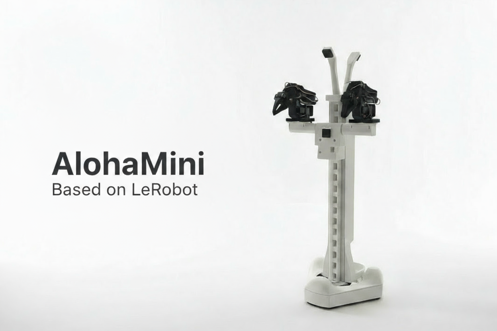

# AlohaMini

AlohaMini is a dual-arm mobile robot with a motorized vertical lift — beautifully designed, fully 3D-printable, and affordable.  

Built for embodied AI research and real-world manipulation. Assemble at home in ~60 minutes, customize every part, and train or deploy with LeRobot.

### What Makes It Different

- **Motorized vertical lift** — 0–60 cm travel (floor-to-table reach)
- **Purpose-engineered structure** — optimized for real-world tasks
- **Completely open-source** — hardware and software freely available
- **LeRobot-compatible** — works out of the box
- **Clean, modern design** — built for both function and aesthetics
- **Low-cost & accessible** — engineered so anyone can build a capable robot at home

## 📸 Gallery

  

## ⚙️ Bill of Materials (BOM)
### Main Components

| Component | Model / Notes | Qty | Unit Price (USD) |
|-----------|---------------|-----|------------------|
| Servo motors | Feetech STS3215 (12V bus) | 16 | $13.89 |
| Motor control boards | Waveshare Bus Servo Adapter (A) | 2 | $10.55 |
| Compute platform | Raspberry Pi 5 (4/8GB) | 1 | $60 |
| Cameras | 720p USB cameras (2 for arms, 3 for mobile base) | 5 | $20 |
| Mobility system | Omni wheels | 3 | $36.00 |
| Battery | 12V Li-ion pack | 2 | $32.99 |
| Frame | 3D-printed body (ABS / PETG / PLA) | — | ~4kg filament (self-print) |
| **Total** | — | — | **~$600 (self-print)** |

Note: 
- Printable STL files under `/hardware/`
- Compute platform can be replaced with Jetson Nano or similar SBCs if desired.
- Additionally, CAD and URDF files will be released soon.
## Quick Start

Start building and running AlohaMini:

1. **Hardware acquisition** — Purchase components and 3D print parts  
   See **[BOM & 3D-Print](docs/BOM.md)**

1. **Assembly** — build the robot in ~60 minutes (SO-ARM pre-assembled)  
   See **[assembly guide](docs/hardware_assembly.md)**

1. **Software setup & teleoperation** — install, connect, and control the robot  
   See **[software guide](docs/software_setup.md)**

##  Product Line
| Model | Build | Rigidity | Target Users |
|---|---|---|---|
| **AlohaMini** | Fully 3D-printed | Standard | Education, makers, research labs, home builds |
| **AlohaMini Pro** | Hybrid **3D-print + metal** | **3×–5× stiffer** | Algorithm-focused researchers who need plug-and-play, reliable, and stable hardware — without assembly effort |

> Same URDF & control stack across both versions — only structural materials differ.

### AlohaMini Pro Access  
Pro hardware & kits available for advanced users.  
📩 **Contact to request early access.**

## Contact
Email: liyiteng+github@gmail.com  
WeChat: liyiteng  
Videos & tutorials soon on: Bilibili / YouTube / TikTok

## Team
AlohaMini is created by:  
**Li Yiteng** / **Wu Zhiyong**

##  Acknowledgements
Thanks to the open robotics community:  
**ALOHA · LeKiwi · SO-ARM100 · SO-ARM100-Track-Axis · Pi-0.5 · LeRobot · Hugging Face**

## ⭐ Support AlohaMini
If you like this project:
- ⭐ Star the repo  
- 🔔 Follow updates  
- 💬 Join the community  

