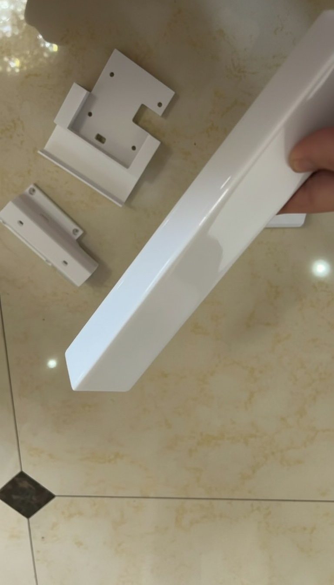

# Assembly

## Mobile Base Assembly

1. Using the servo software ([FD Debug Tool v1.9.8.3](https://www.feetechrc.com/Data/feetechrc/upload/file/20240622/FD1.9.8.3.zip)), assign ID numbers 8, 9, 10, and 11 to the servos respectively.

   **How to adjust:**
   
   To assign ID numbers to the servos using the FD Debug Tool:
   
   - **Download and install** the FD Debug Tool from the link above
   - **Connect** the servo to your computer using the Waveshare Bus Servo Controller (via USB) 
   - **Launch** the FD Debug Tool software
   - **Select** the correct COM port and set the baud rate (typically 1000000 or as specified in your servo manual)
   - **Click** "Scan Servo" to detect the connected servo and its current ID
   - **Change the ID** by entering the desired number (8, 9, 10, or 11) in the ID field
   - **Click** "Write" or "Save" to update the servo's ID
   - **Disconnect** the servo and repeat the process for each remaining servo
   
   **Note:** Make sure to connect and configure only one servo at a time to avoid ID conflicts during the setup process.

1. Connect servos 8, 9, and 10 using the included 20cm servo cables, and connect servos 10 and 11 using a 90cm servo cable.

3. Install M3 heat-set inserts into the servo brackets using a soldering iron.

4. Secure the servos using the small screws included with the servos.

5. Install the wheel axle connectors.

If the connector doesn't fit, sand it down for a better fit.

Connector installation complete (if it's loose, tighten with screws or use epoxy resin for bonding; no additional treatment needed if it's tight enough).

6. Mount the servos to the chassis plate.

Follow the servo order as shown in the image.

7. Secure the servos to the chassis plate using M3x10 screws.

8. Attach the omni wheels to the servo connector using M3x18 screws.

9.  (optional)Install the chassis bearings.
Insert the bearings (12x18x4) into the dowel pin and shaft sleeves.

10. Install M3 heat-set inserts into the side plates.

11. Assemble the main posts like building blocks - there are 4 in total. Use double-sided tape or epoxy resin to bond the parts together.

12. Install the lift axis. Prepare the materials according to the BOM list.

13. Secure the gear using the screws included with the servo.

14. Insert the gear into the Axis_Servo_Mount.

15. Secure the Axis_Bracket to the servo using the included M3x6 screws from the servo.

17. Install the T-bracket.

18. Secure it with double-sided tape or epoxy resin.

19. Slide the lift axis into the T-bracket.

20. Install the Top and Back cameras.
Remove the two screws from the camera back cover.

21. Reinstall the back cover using M2x12 screws, sandwiching the printed part in between.

22. Route the camera cable through the internal channel of the printed part.

23. Secure the display to the printed part using the included M3 servo screws.

24. Slide the display into the rear slot of the main post.

25. Install the Front camera using the same method as the Top camera.

Slide it into the slot. If there are any burrs on the printed part, file them down for a smooth fit.

26. Route the USB Type-C data cable and DC power cable through the hole on the rear side of the main post.

27. Mobile Base assembly complete!

## Leader arms and Follower arms
For the assembly of Leader arms and Follower arms, please refer to the tutorial: [SO-101 Assembly Guide](https://huggingface.co/docs/lerobot/so101). 

## Follower arms and Mobile Base Assembly

1. Secure the robotic arm to both sides of the T-bracket using four M3x30 hex screws and four M3 nuts.
   

2. Connect the 90cm servo cable from servo #11 to the other port on the Waveshare controller board of the **left arm**.
   

3. Attach the 12V to 5V step-down converter to the base and connect it to the Raspberry Pi.
   

4. Connect the 12V lithium battery to the step-down converter to provide power.
   

5. Connect the male plug of the 1-to-2 DC splitter cable to the female connectors of the two DC extension cables.
   

6. Connect the second 12V lithium battery to the female connector of the 1-to-2 DC splitter cable.
   

7. Assembly fully complete!
   

